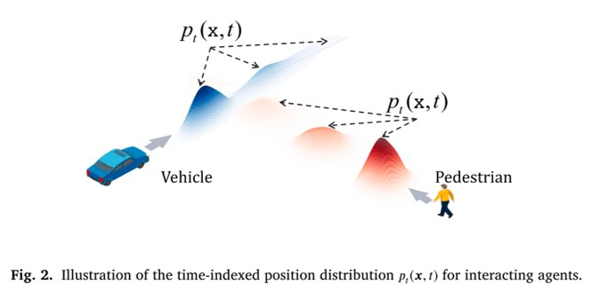

# Vehicle–Pedestrian Interaction Field (Based on Trajectron++)

## 1. Overview

This project builds on **Trajectron++ (Salzmann et al. 2020)** to implement a **vehicle–pedestrian interaction field** (人车交互场) framework.

Compared with the original Trajectron++ implementation, we modify the code so that the model outputs **parameters of trajectory distributions**, rather than only sampled trajectories.

For each prediction step, the model provides the parameters of a **25-component Gaussian mixture**, including:

- Means  
- Standard deviations  
- Correlation coefficients  

These parameters are then used to construct a **probabilistic spatio-temporal field** and to visualize and analyze interaction risk.

---

## 2. Project Structure and Data

The main directory for experiments is:

```text
Probabilistic-Spatio-temporal-Field/experiments
```

Processed datasets are stored under:

```text
Probabilistic-Spatio-temporal-Field/experiments/processed
```

Currently, two types of processed data are included:

- `FC_*`: **Mid-block** scenarios (路中段数据)
- `TJ_*`: **Intersection** scenarios (交叉口数据, derived from **SinD**)

Each `*_train_full.pkl` / `*_test_full.pkl` file follows the standard Trajectron++ data format.

---

## 3. Training the Trajectory Generation Model

Below is an example command to train the trajectory generation model on the **FC (mid-block)** dataset:

```bash
python train.py \
  --eval_every 1 \
  --vis_every 1 \
  --conf ../experiments/nuScenes/models/int_ee/config.json \
  --train_data_dict FC_train_full.pkl \
  --eval_data_dict FC_test_full.pkl \
  --offline_scene_graph yes \
  --preprocess_workers 10 \
  --batch_size 512 \
  --log_dir ../experiments/nuScenes/models \
  --train_epochs 100 \
  --node_freq_mult_train \
  --log_tag _int_ee \
  --site FC
```

**Arguments (key ones):**

- `--conf`: Path to the modified Trajectron++ config used for interaction field experiments.  
- `--train_data_dict` / `--eval_data_dict`: Training and test datasets under `experiments/processed`.  
- `--offline_scene_graph`: Whether to use offline scene graphs (recommended: `yes`).  
- `--site`: Dataset/site identifier (`FC` for mid-block, `TJ` for intersection).  
- `--log_dir`: Directory where models and logs will be saved.  

After training, the model checkpoints will be stored under:

```text
../experiments/nuScenes/models
```

---

## 4. Generating Trajectory Distribution Parameters and Samples

After training, use the following command to:

1. Export the **Gaussian mixture parameters** (means, standard deviations, and correlation coefficients) for each prediction step; and  
2. Sample trajectories for **visualization** and inspection of the interaction field.

Example command for the **FC (mid-block)** test set:

```bash
python evaluate.py \
  --model models/FC_models_01_Nov_2025_07_49_21_int_ee \
  --checkpoint=90 \
  --data ../processed/FC_test_full.pkl \
  --output_path results \
  --output_tag int_ee \
  --node_type VEHICLE \
  --prediction_horizon 12 \
  --site FC
```

**Arguments (key ones):**

- `--model`: Path/name of the trained model directory.  
- `--checkpoint`: Checkpoint index to load (e.g., `90`).  
- `--data`: Test data file (e.g., `FC_test_full.pkl`) under `experiments/processed`.  
- `--output_path`: Directory to save outputs (distribution parameters and sampled trajectories).  
- `--output_tag`: Tag appended to output files.  
- `--node_type`: Node/agent type (e.g., `VEHICLE`).  
- `--prediction_horizon`: Prediction horizon (number of future time steps).  
- `--site`: Dataset/site identifier (`FC` or `TJ`).  

The evaluation script will produce:

- Files containing the **trajectory distribution parameters** (for constructing the probabilistic spatio-temporal field); and  
- **Sampled trajectories**, which can be used directly for plotting and visualizing vehicle–pedestrian interaction patterns.

---

## 5. Notes

- This code is an extension of the original **Trajectron++** framework and assumes a similar environment setup (dependencies, data format, etc.).  
- The 25-component Gaussian mixture parameters are the core outputs used in the subsequent risk field construction and analysis.

## 6. Visualization
# Data and Reproducibility Guide

## Overview

The Google Drive folder below contains the data required to reproduce the visualization results related to **conflict_entropy_up** and **data_for_data_analysis_TJ_one_up**:

https://drive.google.com/drive/folders/12Mju7-eoVVQPnWHAnbshrVO868d75tUl

These files are sufficient for reproducing the visualization and analysis results presented in this repository.

---

## Missing Data Files

Some data files referenced in the code were **not uploaded** due to their large size.

Specifically, the following directory:

```python
base_path = f'/home/wangtao/下载/Trajectron-ped-veh/Data_ana/Data_gen/{location}'
```

contains the prediction outputs generated by our modified version of **Trajectron++**.

The complete dataset includes two study locations:

- FC
- TJ

These files contain trajectory prediction results and Gaussian Mixture Model (GMM) parameters generated by Trajectron++ and are required for reproducing the full risk estimation pipeline.

---

## How to Generate the Missing Files

The missing files can be generated using our modified Trajectron++ implementation.

Please run the code in:

```python
trajectron.py
```

Specifically, the data generation procedure is implemented approximately in:

```python
Line 209 – Line 315
```

After running the prediction process, the following files will be generated automatically for each location.

### Ground-Truth and Prediction Files

```text
{location}_pre_full_*.pkl
{location}_tru_*.pkl
{location}_his_*.pkl
```

These files store:

- Predicted trajectories (`pre_full`)
- Ground-truth trajectories (`tru`)
- Historical observed trajectories (`his`)

They are loaded using:

```python
with open(f'{location}_pre_full_xxx.pkl', 'rb') as f:
    pre_full = pickle.load(f)

with open(f'{location}_tru_xxx.pkl', 'rb') as f:
    tru = pickle.load(f)

with open(f'{location}_his_xxx.pkl', 'rb') as f:
    his = pickle.load(f)
```

---

## Trajectron++ Prediction Outputs

The following files contain the Gaussian Mixture Model (GMM) parameters generated by Trajectron++.

### Vehicle Predictions

```text
{location}_mus_*_VEHICLE_*.pkl
{location}_sigmas_*_VEHICLE_*.pkl
{location}_log_pis_*_VEHICLE_*.pkl
{location}_corrs_*_VEHICLE_*.pkl
{location}_id_*_VEHICLE_*.pkl
{location}_frame_*_VEHICLE_*.pkl
```

Loaded as:

```python
mus_all_car
sigmas_all_car
log_pis_all_car
corrs_all_car
id_all_car
frame_all_car
```

Example dimensions:

```python
mus_all_car      # [N, 12, 25, 2]
sigmas_all_car   # [N, 12, 25, 2]
log_pis_all_car  # [N, 12, 25]
corrs_all_car    # [N, 12, 25]
```

where:

- `N` = number of samples
- `12` = prediction horizon
- `25` = Gaussian mixture components
- `2` = x-y coordinates

---

### Pedestrian Predictions

```text
{location}_mus_*_PEDESTRIAN_*.pkl
{location}_sigmas_*_PEDESTRIAN_*.pkl
{location}_log_pis_*_PEDESTRIAN_*.pkl
{location}_corrs_*_PEDESTRIAN_*.pkl
{location}_id_*_PEDESTRIAN_*.pkl
{location}_frame_*_PEDESTRIAN_*.pkl
```

Loaded as:

```python
mus_all_ped
sigmas_all_ped
log_pis_all_ped
corrs_all_ped
id_all_ped
frame_all_ped
```

These files store the predicted Gaussian mixture distributions for pedestrian trajectories.

---

## Data Structure

For each prediction step, Trajectron++ outputs:

- Mixture means (`mus`)
- Mixture standard deviations (`sigmas`)
- Mixture weights (`log_pis`)
- Correlation coefficients (`corrs`)
- Agent IDs (`id`)
- Frame indices (`frame`)

These parameters are subsequently used to reconstruct the full probabilistic trajectory distribution and compute the conflict-risk entropy visualizations.

---

## Notes

1. The shared Google Drive folder contains all files necessary to reproduce the published visualization results.

2. The large-scale Trajectron++ prediction outputs are not included because of storage limitations.

3. Users wishing to fully reproduce the trajectory prediction stage should first run the modified Trajectron++ model to generate the missing `.pkl` files described above.


## License Notice

This source code is provided for academic research purposes only.

Commercial use, redistribution for commercial purposes, incorporation into commercial products or services, or any other commercial exploitation of this code is strictly prohibited without prior written permission from the copyright holder.

By using this code, you agree to comply with these terms. Any unauthorized commercial use may result in legal action.

4. All experiments were conducted on the FC and TJ datasets.

